# TwiBot-22 Model Architecture (HGT Variant)

This document details the architecture of the bot detection model currently configured in `run_train_eval.sh`. The model is a multi-modal framework that fuses information from the social graph, user text content, and profile metadata.

## 1. High-Level Architecture

The model consists of three parallel branches that process different modalities of user data. These branches converge into a fusion layer for final classification.

```mermaid
graph TD
    subgraph Inputs
        G[Heterogeneous Graph]
        T["User Text<br>(Bio + Tweets)"]
        P["Profile Features<br>(23 dim)"]
    end

    subgraph Encoders
        direction TB
        HGT["<b>HGT Backbone</b><br>3 Layers, 256 dim<br>4 Heads"]
        TXT["<b>Text Encoder</b><br>XLM-RoBERTa w/ LoRA<br>768 dim"]
        PRF["<b>Profile Encoder</b><br>2-Layer MLP<br>64 dim"]
    end

    subgraph Fusion
        C["Concatenation<br>256 + 768 + 64 = 1088 dim"]
        MLP["<b>Classifier MLP</b><br>1088 -> 512 -> 256 -> 128 -> 2"]
    end

    G --> HGT
    P -.->|Projected as<br>User Node Feats| HGT
    T --> TXT
    P --> PRF

    HGT --> C
    TXT --> C
    PRF --> C

    C --> MLP
    MLP --> Output[Bot Probability]
```

## 2. Detailed Component Analysis

### A. Graph Branch: Heterogeneous Graph Transformer (HGT)
The core of the structural analysis is the HGT backbone, which handles the heterogeneity of the TwiBot-22 graph (Users, Tweets, Hashtags, Lists).

*   **Initialization**:
    *   **User Nodes**: Initialized by projecting the 23 raw profile features into the hidden dimension ($256$).
    *   **Other Nodes (Hashtag, List)**: Initialized with learnable type-specific vectors (Xavier Uniform).
    *   **Tweet Nodes**: Can use pre-computed embeddings or learnable vectors.
*   **Architecture**:
    *   **Type**: `HGTBackbone` composed of 3 stacked `HGTTransformerLayer`s.
    *   **Layer Structure**: Follows a rigorous Transformer block design:
        1.  **Attention**: `HGTConv` (Heterogeneous Graph Transformer Convolution)
            *   Uses type-specific query/key/value projection matrices.
            *   Includes edge-type dependent relative temporal encoding (if applicable).
        2.  **Feed-Forward Network (FFN)**:
            *   `Linear(256 -> 1024)` -> `GELU` -> `Dropout` -> `Linear(1024 -> 256)`.
        3.  **Residual Connections & Normalization**:
            *   Pre-Norm architecture: `x = x + Attn(LayerNorm(x))`
            *   `x = x + FFN(LayerNorm(x))`
*   **Hyperparameters**:
    *   **Hidden Dimension**: $256$
    *   **Attention Heads**: $4$
    *   **Layers**: $3$
    *   **Dropout**: $0.3$
    *   **Neighbor Sampling**: `[20, 10, 5]` (samples per hop for the 3 layers).

### B. Text Branch: RoBERTa Encoder
Analyzes the semantic content of users.

*   **Model**: `xlm-roberta-base` (Multilingual).
*   **Input**: Concatenation of user description (bio) and recent tweets.
*   **Mechanism**:
    *   Tokenizes input (max length $256$).
    *   Passes through Transformer.
    *   **LoRA (Low-Rank Adaptation)**: Instead of fine-tuning all $125M+$ parameters, rank decomposition matrices ($r=8, \alpha=16$) are injected into attention layers (`query`, `value`). This makes training efficient.
    *   **Pooling**: Mean pooling of the last hidden state (masked to ignore padding).
*   **Output Dimension**: $768$.

### C. Profile Branch: Feature MLP
Processes explicit numerical and binary attributes.

*   **Input Features (23 total)**:
    *   **Numeric (15)**: Followers, Following, Tweet Count, Listed Count, Account Age, Tweets/Day, Ratios, Bio Length, + 7 derived Interaction Stats (reply latency, similarity, etc.).
    *   **Binary (8)**: Verified, Protected, Has URL, Has Location, etc.
*   **Architecture**:
    *   Layer 1: `Linear(23 -> 128)` -> `LayerNorm` -> `ReLU` -> `Dropout(0.3)`
    *   Layer 2: `Linear(128 -> 64)` -> `LayerNorm` -> `ReLU` -> `Dropout(0.3)`
*   **Output Dimension**: $64$.

## 3. Fusion & Classification

The outputs of the three branches are concatenated to form a dense user representation vector.

*   **Fusion Vector**: $256 \text{ (Graph)} + 768 \text{ (Text)} + 64 \text{ (Profile)} = 1088$ dimensions.
*   **Classifier MLP**:
    *   Input: $1088$
    *   Hidden 1: $512$ (`Linear` -> `LayerNorm` -> `ReLU` -> `Dropout`)
    *   Hidden 2: $256$ (`Linear` -> `LayerNorm` -> `ReLU` -> `Dropout`)
    *   Hidden 3: $128$ (`Linear` -> `LayerNorm` -> `ReLU` -> `Dropout`)
    *   Output: $2$ (Logits for Human vs. Bot)
*   **Loss Function**: **Focal Loss** ($\gamma=1.5$)
    *   Focuses training on hard-to-classify examples.
    *   Class weights are balanced, with bots weighted $2.0x$ more (`BOT_WEIGHT_MULT=2.0`) to prioritize recall.

## 4. Hyperparameter Configuration Summary

| Parameter | Value | Source |
| :--- | :--- | :--- |
| **Hidden Dimension** | 256 | `run_train_eval.sh` |
| **Backbone Layers** | 3 | `run_train_eval.sh` |
| **Graph Heads** | 4 | `run_train_eval.sh` |
| **Dropout** | 0.3 | `run_train_eval.sh` |
| **Neighbor Sizes** | 20, 10, 5 | `run_train_eval.sh` |
| **Text Model** | xlm-roberta-base | `run_train_eval.sh` |
| **Text Max Len** | 256 | `run_train_eval.sh` |
| **LoRA Enabled** | True | `run_train_eval.sh` |
| **Batch Size** | 128 | `run_train_eval.sh` |
| **Bot Class Weight** | 2.0x | `run_train_eval.sh` |
| **Optimizer** | AdamW | `optim.py` |
| **LR (Backbone)** | 1e-4 | `run_train_eval.sh` |
| **LR (Text)** | 2e-5 | `run_train_eval.sh` |

## 5. HGT Layer Diagram

